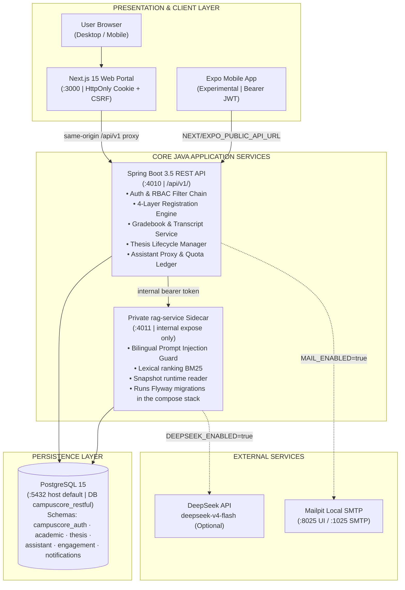
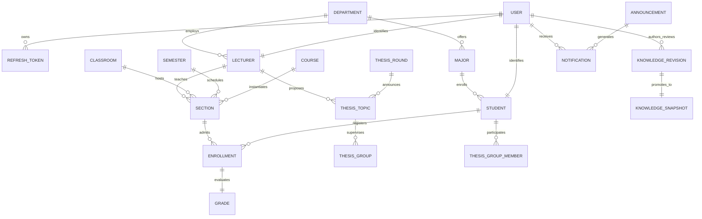
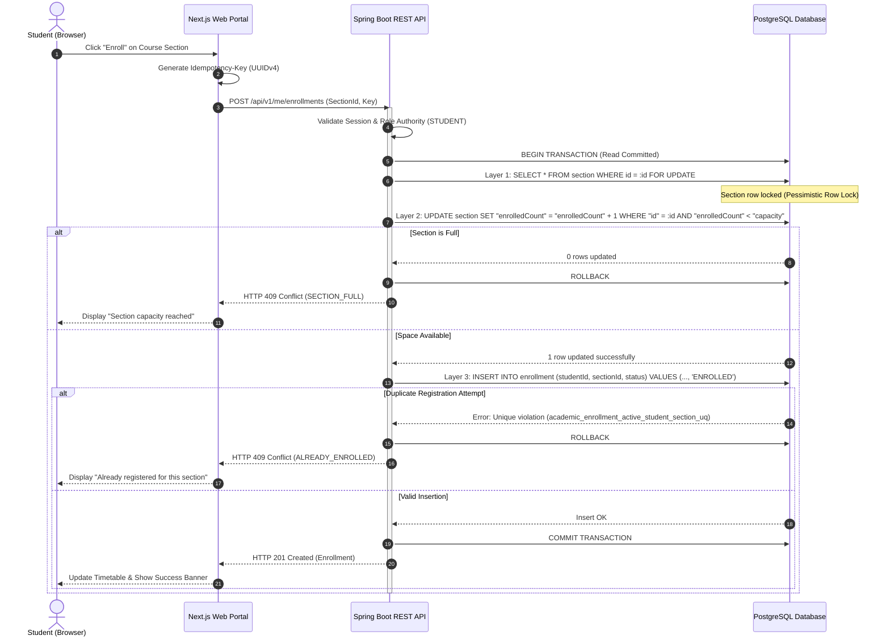
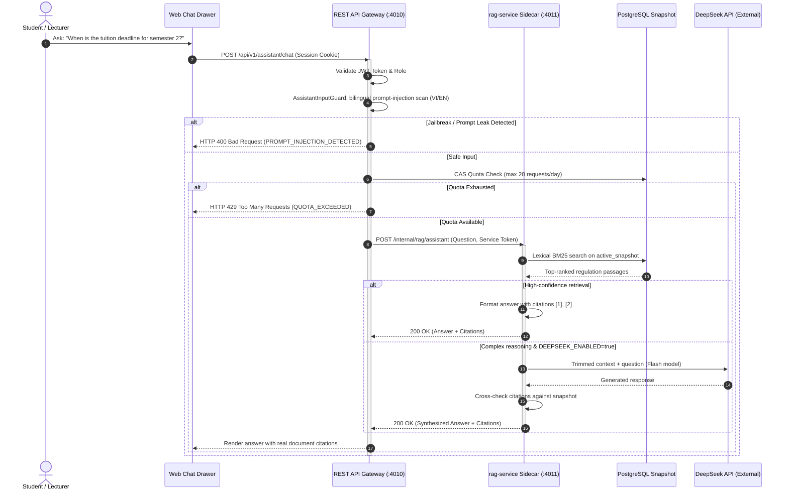
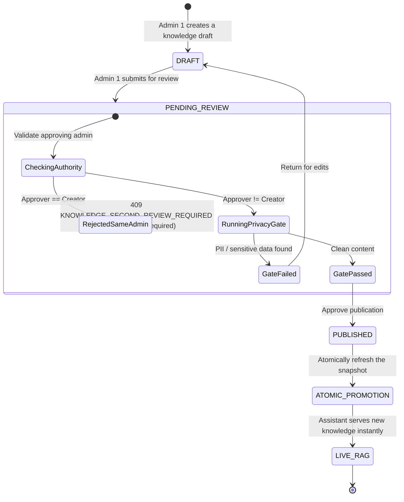
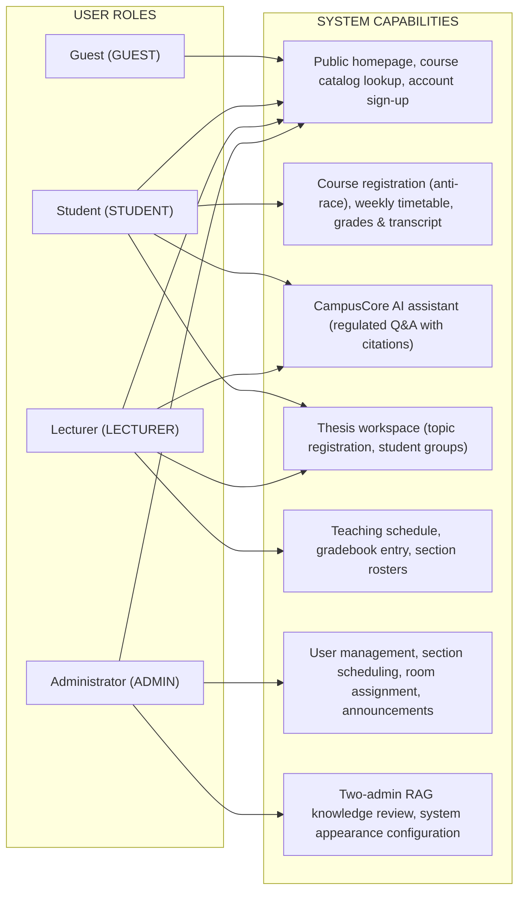

# CampusCore — Bilingual Enterprise Academic Information & Management System

> **A publication-grade academic portal for identity, course registration, grading, thesis lifecycle, and an intelligent RAG assistant.**
> Service-oriented architecture: a central Spring Boot Java REST API, a Next.js Web Portal, PostgreSQL managed via Flyway, and a private RAG sidecar reachable only inside the internal network.

[](https://openjdk.org/)
[](https://spring.io/projects/spring-boot)
[](https://nextjs.org/)
[](https://www.postgresql.org/)
[](https://flywaydb.org/)
[](https://www.docker.com/)

> This is the English mirror of the documentation. The Vietnamese source of truth lives in [README.md](README.md).

---

## Table of Contents

1. [Project Overview](#project-overview)
2. [Live Application UI Showcase & Animated GIFs](#live-application-ui-showcase--animated-gifs)
   - [Public Homepage & Multi-Portal Gateway](#1-public-homepage--multi-portal-gateway)
   - [Student Journey (Role: STUDENT)](#2-student-journey-role-student)
   - [Lecturer Journey (Role: LECTURER)](#3-lecturer-journey-role-lecturer)
   - [Administrator Journey (Role: ADMIN)](#4-administrator-journey-role-admin)
   - [Animated GIFs Demonstration](#5-animated-gifs-demonstration)
3. [Core Technical Innovations](#core-technical-innovations)
   - [4-Layer Anti-Race Concurrency Control Engine](#1-4-layer-anti-race-concurrency-control-engine)
   - [Bilingual RAG Assistant & Atomic Quota Ledger](#2-bilingual-rag-assistant--atomic-quota-ledger)
   - [Two-Admin Knowledge Governance Workflow](#3-two-admin-knowledge-governance-workflow)
   - [Fail-Closed Security & Timing-Safe Secrets](#4-fail-closed-security--timing-safe-secrets)
4. [System Architecture & Diagrams](#system-architecture--diagrams)
   - [High-Level Topology](#high-level-topology)
   - [Database Entity Relationship Diagram (ERD)](#database-entity-relationship-diagram-erd)
   - [4-Layer Anti-Race Enrollment Sequence](#4-layer-anti-race-enrollment-sequence)
   - [CampusCore RAG Assistant Query Pipeline](#campuscore-rag-assistant-query-pipeline)
   - [Two-Admin Knowledge State Machine](#two-admin-knowledge-state-machine)
   - [Role-Based Access Control (RBAC) Flow](#role-based-access-control-rbac-flow)
5. [Technology Stack](#technology-stack)
6. [Installation & Local Deployment Guide](#installation--local-deployment-guide)
7. [Demo Test Accounts](#demo-test-accounts)
8. [RESTful API Specification](#restful-api-specification)
9. [Testing and Quality Assurance](#testing-and-quality-assurance)
10. [Reference Documentation](#reference-documentation)

---

## Project Overview

**CampusCore** is an enterprise-grade academic management and information system designed to support students, faculty members, and academic administrators within a single unified platform.

Inspired by the academic credit system and institutional identity of **Ho Chi Minh City University of Technology and Education (HCMUTE)**, CampusCore delivers a bilingual (English & Vietnamese) interface while solving critical distributed software engineering challenges: **peak-hour course registration stampedes**, **tamper-proof gradebook management**, **end-to-end thesis supervision**, and **trustworthy academic Q&A with server-verified citations using Retrieval-Augmented Generation (RAG)**.

```
Next.js Web Portal (:3000) ────┐
                               ├───► Spring Boot REST API (:4010) ───► PostgreSQL (:5432)
Expo Mobile App (Experimental)─┘         │ (internal /internal/rag)
                                         ▼
                                  rag-service Sidecar (:4011) ───► (Optional) DeepSeek API
```

> The ports above are the **Docker Compose defaults**. Every host port can be overridden through environment variables in `.env` (see the [Installation guide](#installation--local-deployment-guide)).

---

## Live Application UI Showcase & Animated GIFs

All screenshots and animated GIFs below were captured directly from the running local environment.

### 1. Public Homepage & Multi-Portal Gateway

| English Homepage | Vietnamese Homepage |
| --- | --- |
|  |  |

| Multi-Portal Sign In (Student / Lecturer / Admin) | Student Self-Registration Interface |
| --- | --- |
|  |  |

---

### 2. Student Journey (Role: STUDENT)

Demo Account: `student@campuscore.edu` | Password: `password123`

| Student Overview Dashboard | Course Registration Portal |
| --- | --- |
|  |  |
| *Academic progress signals, today's schedule, and announcements* | *Live course catalog, capacity validation, and anti-race submission* |

| Enrolled Courses & Credit Summary | Weekly Visual Timetable |
| --- | --- |
|  |  |
| *Registered section roster, credit counters, and course drop* | *Interactive grid sorted by day, periods, and room assignments* |

| Continuous Evaluation Grades | Cumulative Academic Transcript |
| --- | --- |
|  |  |
| *Midterm, final exam, lab assignments, and letter grades* | *Official cumulative transcript with GPA on 4.0 and 10.0 scales* |

| CampusCore AI Assistant Chat Drawer | Graduation Thesis Portal |
| --- | --- |
|  |  |
| *RAG-powered Q&A with verified document citations & daily quota* | *Thesis defense rounds, mentor topics, and group registration* |

---

### 3. Lecturer Journey (Role: LECTURER)

Demo Account: `lecturer@campuscore.edu` | Password: `password123`

| Lecturer Overview Dashboard | Weekly Teaching Schedule |
| --- | --- |
|  |  |
| *Assigned sections, student headcounts, and upcoming lectures* | *Weekly teaching schedule with room assignments and rosters* |

| Grade Management Overview | Section Gradebook Entry Spreadsheet |
| --- | --- |
|  |  |
| *Submission deadlines and grade lock status per section* | *Direct in-place score input for continuous & final components* |

---

### 4. Administrator Journey (Role: ADMIN)

Demo Account: `admin@campuscore.edu` | Password: `admin123`

| Operational Administration Dashboard | User Accounts & Role Provisioning |
| --- | --- |
|  |  |
| *System health metrics, student counts, and administrative tools* | *Provision users, assign roles (Student, Lecturer, Admin)* |

| Course Sections & Scheduling | Two-Admin Knowledge Governance |
| --- | --- |
|  |  |
| *Open course sections, set capacities, assign faculty and rooms* | *Review drafts, enforce four-eyes principle, and trigger privacy gate* |

---

### 5. Animated GIFs Demonstration

#### Student Full Experience Tour
From Login → Dashboard → Course Registration → Timetable → Transcript → CampusCore AI Assistant:


#### Lecturer & Administrator Tour
Lecturer teaching schedule and grade entry → Admin overview, section scheduling, and 2-Admin knowledge publication:


#### Instant Bilingual Switch
Seamless live switching between English and Vietnamese across the entire application:


---

## Core Technical Innovations

### 1. 4-Layer Anti-Race Concurrency Control Engine

To eliminate overselling during high-traffic course registration windows, CampusCore employs a deep **4-layer concurrency defense model**:

1. **Layer 1 (Pessimistic Row Lock)**: Executes `SELECT * FROM academic."Section" WHERE "id" = :id FOR UPDATE` inside a database transaction, forcing concurrent threads to queue up deterministically.
2. **Layer 2 (Atomic Conditional Update)**: Modifies capacity using `UPDATE academic."Section" SET "enrolledCount" = "enrolledCount" + 1 WHERE "id" = :id AND "enrolledCount" < "capacity";`. If full, 0 rows are updated and the transaction instantly rolls back.
3. **Layer 3 (Partial Unique Index)**: Enforces the partial unique index `academic_enrollment_active_student_section_uq` on `academic."Enrollment" ("studentId", "sectionId") WHERE "status" IN ('ENROLLED', 'PENDING', 'CONFIRMED')`, guaranteeing at the database engine level that a student cannot hold two active enrollments in the same section.
4. **Layer 4 (Idempotency Key)**: The web portal sends an `Idempotency-Key` header (UUIDv4) with every enroll/drop request; the system records the key so network retries never double-apply a mutation.
5. **Verified by tests**: `AcademicEnrollmentMutationPersistenceTest` spawns independent threads competing for the last remaining seat (see [Testing](#testing-and-quality-assurance) to re-run it).

---

### 2. Bilingual RAG Assistant & Atomic Quota Ledger

- **Network Isolation**: Encapsulated within a private sidecar (`rag-service`, internal port 4011, only `expose`d on the Compose network — never published to the host). No public AI endpoints are exposed.
- **Bilingual Prompt Injection Guard (`AssistantInputGuard`)**: Filters adversarial system prompt overrides and jailbreaks in both Vietnamese and English (*"ignore previous instructions"*, *"bỏ qua hướng dẫn trước đó"*).
- **Atomic Quota Bucket (20 requests/user/day)**: Enforces daily consumption limits using Compare-And-Swap (CAS) so parallel tabs cannot exceed the quota.
- **Deterministic Lexical Search + LLM Fallback**:
  - Baseline: BM25 / tsvector retrieval against immutable PostgreSQL snapshots, serving citations `[1]`, `[2]` with low latency.
  - Optional DeepSeek Integration: When `DEEPSEEK_ENABLED=true`, complex queries are routed to `deepseek-v4-flash`. The system automatically falls back to the lexical response on timeout or missing credentials.

---

### 3. Two-Admin Knowledge Governance Workflow

- **Four-Eyes Principle**: Knowledge revisions are created in `DRAFT` or `PENDING_REVIEW` state by Admin 1. The publish query only accepts a pending revision created by a different admin (`created_by <> actor`); if the only pending revision is the requester's own, the API returns `409 Conflict` with code `KNOWLEDGE_SECOND_REVIEW_REQUIRED` ("A different admin must publish this revision").
- **Automated Privacy Gate**: Inspects drafts for PII (emails, phone numbers, secret keys) before promotion into the active RAG runtime snapshot.

---

### 4. Fail-Closed Security & Timing-Safe Secrets

- **Fail-Closed Bootstrapping**: Critical security credentials (JWT secret, refresh secret, health check key) are validated at application startup; missing required configuration fails the boot instead of running on insecure defaults. Values shipped in `.env.example` are local-only placeholders and must be replaced before real deployments.
- **Timing-Safe Equality**: Validates CSRF tokens, health check keys, and service authentication tokens using `MessageDigest.isEqual()` to prevent timing side-channel attacks.
- **Client Token Separation**: The web client uses HTTP-only SameSite=Strict cookies with CSRF protection; the mobile client uses Bearer access and refresh tokens.

---

## System Architecture & Diagrams

### High-Level Topology



> Inside the Docker Compose stack, the `rag-service` container is the Flyway migration executor (`restful-api` runs with `FLYWAY_ENABLED=false` so two processes never race). When running the JAR directly outside Compose, Flyway is enabled by default via `application.yml`. Migration scripts live under `java-services/restful-api/src/main/resources/db/migration/`.

---

### Database Entity Relationship Diagram (ERD)



---

### 4-Layer Anti-Race Enrollment Sequence



---

### CampusCore RAG Assistant Query Pipeline



---

### Two-Admin Knowledge State Machine



---

### Role-Based Access Control (RBAC) Flow



---

## Technology Stack

| Layer | Technology | Version | Purpose |
| --- | --- | --- | --- |
| **Backend API** | Java / Spring Boot | 21 / 3.5.16 | Central RESTful API, Spring Security, Validation, JPA/Hibernate |
| **Frontend Web** | Next.js (App Router) | 15.5 | Interactive portal, Server Components, same-origin `/api/v1` proxy |
| **UI Libraries** | Tailwind CSS, Radix UI, TinyMCE | 3.4 / Radix / 8 | HCMUTE-inspired design system, data tables, rich-text editing |
| **Build Tooling** | Maven / Node.js | 3.9.12 / 20 | Java build tool and Node runtime for the frontend |
| **Database** | PostgreSQL | 15 (postgres:15-alpine) | ACID transactions, partial indexes, tsvector full-text search |
| **Schema Management** | Flyway | bundled with Spring Boot | Versioned migrations in `java-services/restful-api/src/main/resources/db/migration/` |
| **RAG Sidecar** | Spring Boot (sidecar mode) | 3.5.16 | Internal AI service on port 4011, lexical ranking, injection guard |
| **AI Model** | DeepSeek | deepseek-v4-flash | Optional LLM for complex questions, fully switchable via `DEEPSEEK_ENABLED` |
| **Email Testing** | Mailpit | v1.21 | Local SMTP sink for notification emails in development |
| **Testing & QA** | JUnit 5, Mockito, node:test, Playwright | Latest | Backend unit tests, frontend smoke tests, Playwright e2e |
| **Deployment** | Docker & Docker Compose | Compose v2 | Packages 5 containers: postgres, mailpit, rag-service, restful-api, web |

---

## Installation & Local Deployment Guide

### Prerequisites

- Docker Desktop 24.0+ installed and running.
- At least 4 GB of free RAM and ports `3000` (web), `4010` (API), `5432` (PostgreSQL), `8025` (Mailpit UI) available.

### Quick Start Commands

```powershell
# 1. Clone the repository
git clone https://github.com/JasonTM17/Student_Management_UTE.git
cd Student_Management_UTE

# 2. Create a local environment file from the template and review the secrets
Copy-Item .env.example .env

# 3. Launch the full stack via Docker Compose
docker compose up -d --build postgres mailpit rag-service restful-api web

# 4. Verify container health status
docker compose ps

# 5. Verify API health probes
#    Note: replace <HEALTH_READINESS_KEY> with the HEALTH_READINESS_KEY value from your .env
curl.exe http://127.0.0.1:4010/api/v1/health/liveness
curl.exe -H "X-Health-Key: <HEALTH_READINESS_KEY>" http://127.0.0.1:4010/api/v1/health/readiness

# 6. Inspect the OpenAPI contract
curl.exe http://127.0.0.1:4010/v3/api-docs
```

### Port Mappings & Overrides

The values below are the **Docker Compose defaults**. Every host port can be overridden through the matching environment variable in `.env` (definitions live in `docker-compose.yml`; the template lives in `.env.example`):

| Service | Default host port | `.env` override |
| --- | --- | --- |
| Web Portal (Next.js) | `3000` | `FRONTEND_HOST_PORT` |
| RESTful API | `4010` | `RESTFUL_API_HOST_PORT` |
| PostgreSQL | `5432` | `POSTGRES_HOST_PORT` |
| Mailpit UI / SMTP | `8025` / `1025` | `MAILPIT_UI_HOST_PORT` / `MAILPIT_SMTP_HOST_PORT` |
| rag-service | not published (internal 4011) | — |

### Access Endpoints

- **Web Portal**: `http://127.0.0.1:3000`
- **Swagger / OpenAPI**: `http://127.0.0.1:4010/swagger-ui.html`
- **Mailpit Web UI**: `http://127.0.0.1:8025`
- **PostgreSQL**: `127.0.0.1:5432` | Database: `campuscore_restful` | User: `campuscore`

---

## Demo Test Accounts

| Role | Email | Password | Granted Scope |
| --- | --- | --- | --- |
| **Student** | `student@campuscore.edu` | `password123` | Course enrollment, timetable, grades, AI assistant, thesis |
| **Lecturer** | `lecturer@campuscore.edu` | `password123` | Teaching schedule, gradebook entry, thesis guidance |
| **Admin** | `admin@campuscore.edu` | `admin123` | User administration, catalog & section scheduling, RAG drafting |
| **Second Admin** | `admin002@campuscore.demo` | `admin123` | Independent admin used for the Four-Eyes cross-review of RAG knowledge |

The demo seed also provisions a supporting lecturer directory (`lecturer002@campuscore.demo` through `lecturer012@campuscore.demo`) so section rosters, committees, and teaching schedules mirror a real campus population.

---

## RESTful API Specification

All endpoints share the `/api/v1` prefix and are grouped by resource. The **complete, machine-readable catalog** (including request/response schemas) is published at `GET /v3/api-docs`, with a browsable Swagger UI at `/swagger-ui.html`:

| Resource Group | Path Prefix | Description |
| --- | --- | --- |
| Authentication & sessions | `/api/v1/auth` | Sign-up, role-scoped portal sign-in, token refresh, sign-out |
| Personal profile | `/api/v1/me` | Profile data, registration eligibility, registration summary and slip |
| Course registration | `/api/v1/me/enrollments` | Enroll (4-layer anti-race, mandatory `Idempotency-Key`), drop, list enrolled sections |
| Catalog & lookups | `/api/v1/sections`, `/api/v1/schedules`, `/api/v1/attendance`, `/api/v1/lecturers` | Section catalog, timetables, attendance, lecturer directory |
| Admin catalog | `/api/v1/departments`, `/api/v1/courses`, `/api/v1/classrooms`, `/api/v1/semesters`, `/api/v1/academic-years` | Maintain the academic catalog tree and open sections |
| User administration | `/api/v1/users` | Manage accounts and assign Student / Lecturer / Admin roles |
| Graduation thesis | `/api/v1/thesis`, `/api/v1/thesis/rounds`, `/api/v1/thesis/topics`, `/api/v1/thesis/groups` | Defense rounds, topic proposals, student groups, grading and progress |
| CampusCore AI assistant | `/api/v1/assistant` | RAG Q&A (`/chat`), SSE streaming (`/chat/stream`), message feedback |
| RAG knowledge governance | see Swagger (assistant-knowledge group) | Draft creation, two-admin review, privacy gate activation |
| Announcements & notifications | `/api/v1/announcements`, `/api/v1/notifications` | Academic bulletin board and per-user notification inbox |
| System health | `/api/v1/health` | Liveness and readiness probes guarded by `X-Health-Key` |

---

## Testing and Quality Assurance

```powershell
# Run the backend verification suite
mvn -q -f java-services/pom.xml verify

# Run frontend tests (node:test)
npm test --prefix frontend

# TypeScript type checking
npm run typecheck --prefix frontend

# ESLint checks
npm run lint --prefix frontend

# Build the frontend production bundle
npm run build --prefix frontend

# Re-run the multi-threaded anti-race test in isolation
mvn test -f java-services/pom.xml -Dtest=AcademicEnrollmentMutationPersistenceTest
```

### Safety Verification Matrix

- **Race Condition Concurrency Test**: `AcademicEnrollmentMutationPersistenceTest` spawns independent threads competing for a section's last seat. Exactly one thread succeeds, the rest receive HTTP 409, and capacity is never oversold.
- **Bilingual Injection Test**: The `AssistantInputGuard` test suite covers prompt-injection variants in English and Vietnamese; malicious inputs are rejected at the gateway layer.
- **Two-Admin Governance Test**: A self-approval attempt (creator approving their own pending draft) is rejected with `409 Conflict` (`KNOWLEDGE_SECOND_REVIEW_REQUIRED`) as designed.

---

## Reference Documentation

- [System Architecture Details (docs/ARCHITECTURE.md)](docs/ARCHITECTURE.md): runtime boundaries, concurrency invariants, and non-goals.
- [Step-by-Step Demo Runbook (docs/DEMO_RUNBOOK.md)](docs/DEMO_RUNBOOK.md): guided script for evaluation sessions.
- [Release Criteria (docs/RELEASE.md)](docs/RELEASE.md): container packaging and acceptance standards.
- [Production deployment (docs/deployment.md)](docs/deployment.md) and [PRODUCTION_RUNBOOK.md](docs/PRODUCTION_RUNBOOK.md).
- [DeepSeek Assistant Integration (docs/integrations/deepseek-assistant.md)](docs/integrations/deepseek-assistant.md): secure configuration and fallback behavior.
- [Vietnamese Documentation (README.md)](README.md).

---

*CampusCore Student & Academic Management System — Faculty of Information Technology, HCMUTE.*
