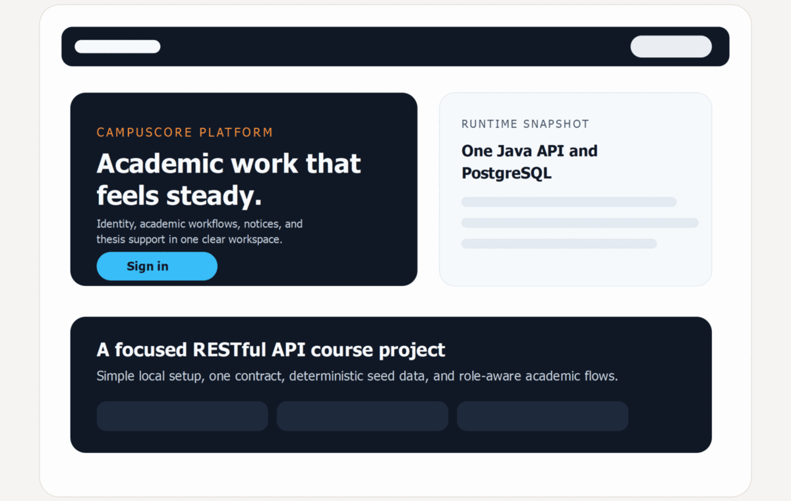
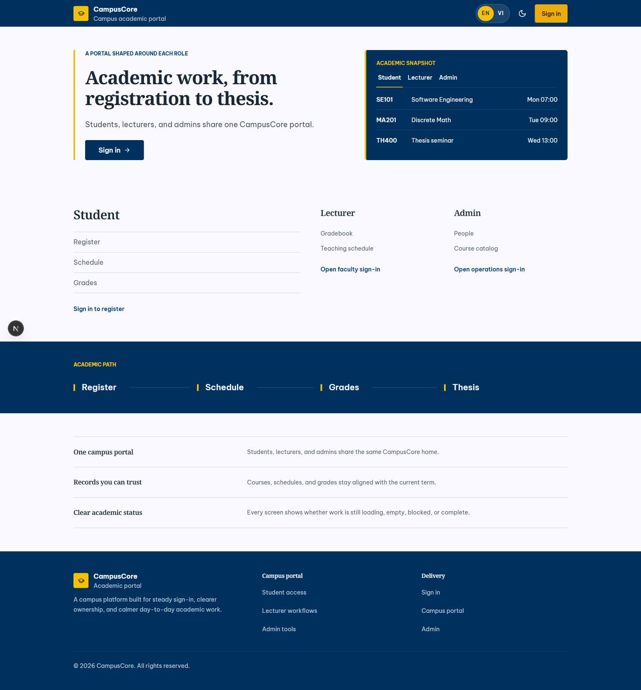
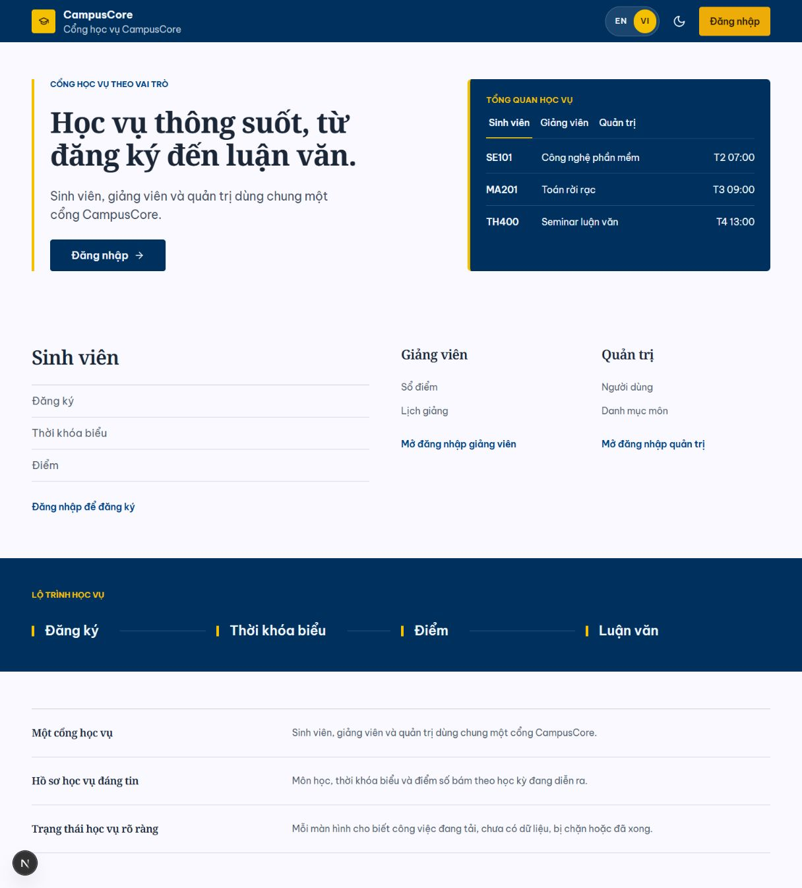
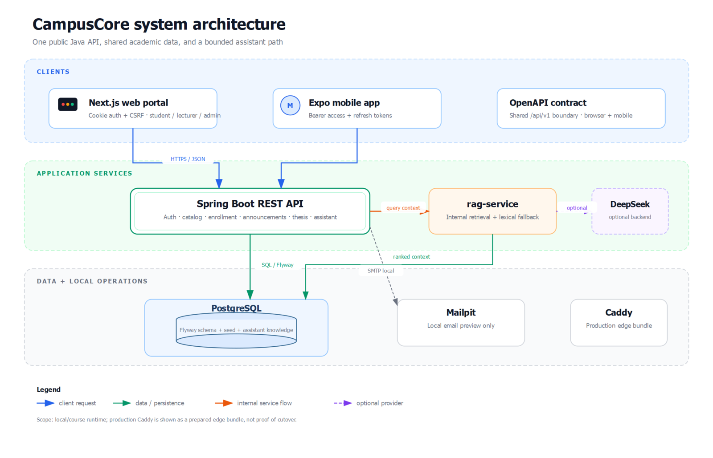

# CampusCore

> A bilingual academic workspace for identity, coursework, notices, and thesis
> workflows — one Java API, one contract, and one shared PostgreSQL source.



## Screenshots and system map

The homepage previews below are direct screenshots from the live CampusCore web
app and show the English/Vietnamese visual direction without implying a
production deployment.

| English homepage | Vietnamese homepage |
| --- | --- |
|  |  |



Open the [vector system diagram](docs/assets/campuscore-system-architecture.svg)
for a zoomable version. The complete runtime boundaries and non-goals live in
[docs/ARCHITECTURE.md](docs/ARCHITECTURE.md).

CampusCore is a medium-sized course project built as one Java Spring Boot
RESTful API, one Next.js web app, one Expo mobile app, and one PostgreSQL
database.

The retained scope covers authentication, role-based student/lecturer/admin
flows, academic catalog, enrollment, schedules, grades, announcements,
notifications, thesis core, and a PostgreSQL-backed curated lexical thesis
assistant served by the internal `rag-service` container with citations.

Finance, analytics, support tickets, external AI providers, vector search,
Redis, RabbitMQ, MinIO, Nginx, Kubernetes, Cloudflare Tunnel, and multi-image
production release are intentionally excluded. The GHCR workflow still
publishes a migration-free PostgreSQL wrapper so the course stack has a
matching database artifact; Flyway in the REST API remains the schema and seed
owner.

Run the stack with:

```powershell
docker compose up -d --build postgres mailpit rag-service restful-api web
curl.exe http://127.0.0.1:4010/api/v1/health/liveness
curl.exe -H "X-Health-Key: local-course-health-key" http://127.0.0.1:4010/api/v1/health/readiness
curl.exe http://127.0.0.1:4010/v3/api-docs
```

Mailpit is available at `http://127.0.0.1:8025`.

Local seed accounts:

| Role | Email | Password |
| --- | --- | --- |
| Student | `student@campuscore.edu` | `password123` |
| Lecturer | `lecturer@campuscore.edu` | `password123` |
| Admin | `admin@campuscore.edu` | `admin123` |

These credentials are only for the local course database.

See [ARCHITECTURE.md](docs/ARCHITECTURE.md), [RELEASE.md](docs/RELEASE.md),
and [RESTFUL_API_CONSOLIDATION.md](docs/RESTFUL_API_CONSOLIDATION.md) for the
complete course acceptance gates.
