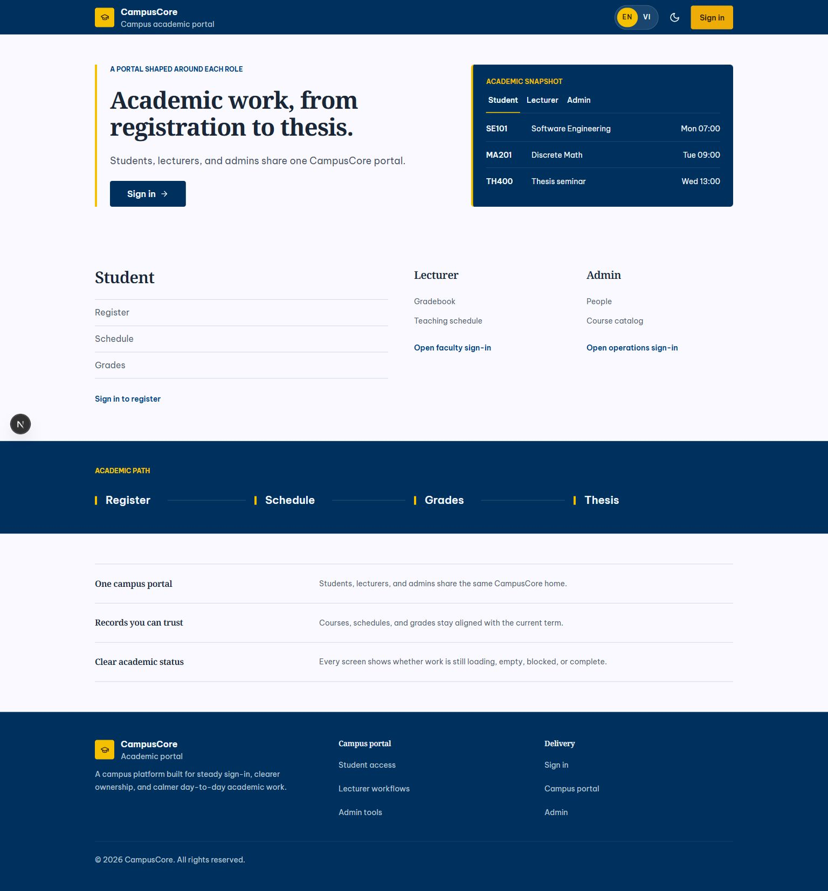
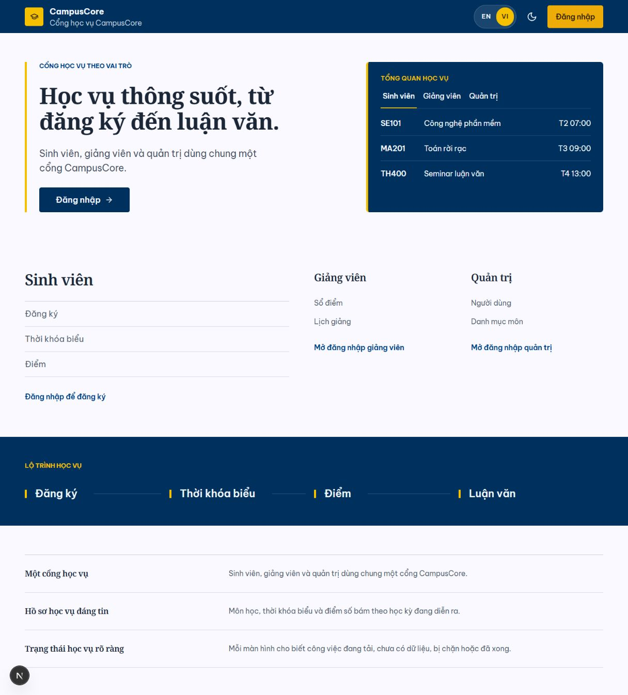
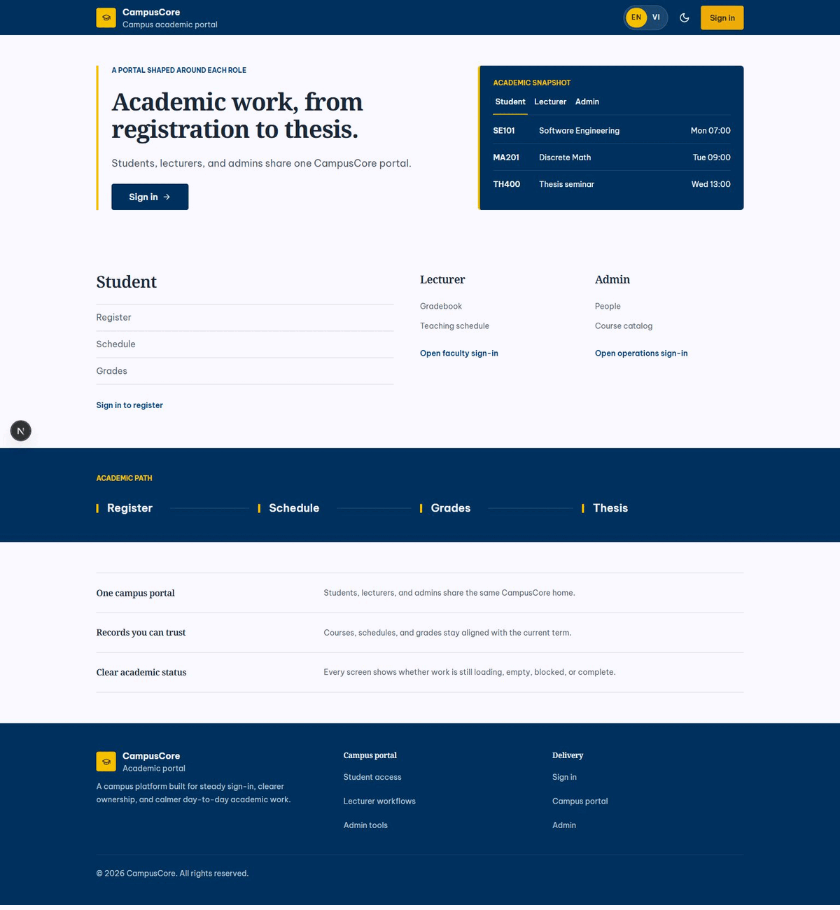

# CampusCore

> Không gian học vụ song ngữ cho identity, học phần, thông báo và thesis — một
> Java API, một contract và một PostgreSQL làm nguồn dữ liệu chung.



## Ảnh giao diện thật và sơ đồ hệ thống

Hai ảnh dưới đây là ảnh chụp trực tiếp từ web app CampusCore đang chạy, dùng để
đọc nhanh hướng thiết kế song ngữ của CampusCore.

| English homepage | Trang chủ tiếng Việt |
| --- | --- |
|  |  |

### GIF chuyển đổi ngôn ngữ




Sơ đồ vector có thể phóng to tại
[campuscore-system-architecture.svg](docs/assets/campuscore-system-architecture.svg).
Các boundary và non-goal đầy đủ nằm trong
[docs/ARCHITECTURE.md](docs/ARCHITECTURE.md).

CampusCore là đồ án quản lý sinh viên dạng RESTful API tầm trung, gồm một
Spring Boot Java API, một ứng dụng Next.js, một ứng dụng Expo và một PostgreSQL.

## Thành phần

- API: `java-services/restful-api`
- RAG service: `rag-service`
- Web: `frontend`
- Mobile: `mobile`
- Database: PostgreSQL qua Flyway

## Chức năng lõi

- Đăng ký, đăng nhập, refresh, logout, profile và đổi mật khẩu.
- Student, lecturer, admin; học kỳ, khoa, ngành, môn học, phòng học, lớp học phần.
- Đăng ký/hủy học phần, lịch học, điểm và bảng điểm.
- Announcement và notification inbox.
- Thesis core: round, topic, group, member, progress/status.
- CampusCore assistant dùng `rag-service` nội bộ cho các domain học vụ công
  khai (đăng ký, lịch, thông báo, chính sách, danh mục và luận văn), có citation,
  lexical fallback và tùy chọn DeepSeek V4 Flash chỉ ở backend.

Finance, analytics, support ticket, vector database, Redis, RabbitMQ, MinIO,
Nginx, Kubernetes, Cloudflare tunnel không thuộc runtime của đồ án. Compose
local/course vẫn tách khỏi `docker-compose.prod.yml`; production bundle dùng
Caddy, image tag bất biến, secret file và backup/restore runbook nhưng chưa phải
cutover VPS. DeepSeek là tích hợp tùy chọn, mặc định tắt và không cần để chạy
local lexical fallback.

## Chạy local

```powershell
docker compose up -d --build postgres mailpit rag-service restful-api web
curl.exe http://127.0.0.1:4010/api/v1/health/liveness
curl.exe -H "X-Health-Key: local-course-health-key" http://127.0.0.1:4010/api/v1/health/readiness
curl.exe http://127.0.0.1:4010/v3/api-docs
mvn -q -f java-services/pom.xml verify
npm test --prefix frontend
npm run typecheck --prefix frontend
npm run lint --prefix frontend
npm run build --prefix frontend
npm test --prefix mobile
npm run typecheck --prefix mobile
```

Mailpit UI ở `http://127.0.0.1:8025`.

## Gói production chờ VPS/domain

`docker-compose.prod.yml`, `ops/caddy/Caddyfile`, `ops/secrets/README.md`,
`ops/backup/` và [docs/PRODUCTION_RUNBOOK.md](docs/PRODUCTION_RUNBOOK.md)
được chuẩn bị để triển khai sau khi có domain, DNS, firewall và secret runtime.
Production chỉ mở Caddy ở cổng 80/443; không dùng Mailpit và không mount secret
vào web client. Cần đặt `CAMPUSCORE_IMAGE_TAG` là full SHA đã review và xác nhận
digest giống nhau trên Docker Hub/GHCR trước khi khởi động.

### Tùy chọn DeepSeek RAG

Chỉ inject secret ở process/server runtime sau khi đã revoke và rotate key bị
lộ. Không đặt key trong `NEXT_PUBLIC_*`, Expo, git, ticket, screenshot hoặc
log. Copy `.env.example` thành `.env`, thay placeholder bằng secret mới rồi
bật `DEEPSEEK_ENABLED=true`; nếu thiếu key, provider lỗi, hết quota hoặc không
có tài liệu phù hợp, API tự trả lexical fallback. Model mặc định là
`deepseek-v4-flash`, non-thinking, context tối đa 6.000 ký tự và output tối đa
800 tokens. Xem [docs/integrations/deepseek-assistant.md](docs/integrations/deepseek-assistant.md).

## Tài khoản demo

| Role | Email | Mật khẩu |
| --- | --- | --- |
| Student | `student@campuscore.edu` | `password123` |
| Lecturer | `lecturer@campuscore.edu` | `password123` |
| Admin | `admin@campuscore.edu` | `admin123` |

Các tài khoản này chỉ dành cho database seed local của đồ án.

## Tài liệu

- [README.vi.md](README.vi.md)
- [README.en.md](README.en.md)
- [docs/ARCHITECTURE.md](docs/ARCHITECTURE.md)
- [docs/RELEASE.md](docs/RELEASE.md)
- [docs/RESTFUL_API_CONSOLIDATION.md](docs/RESTFUL_API_CONSOLIDATION.md)

Đây là local/course demo reproducible, không phải production deployment.
