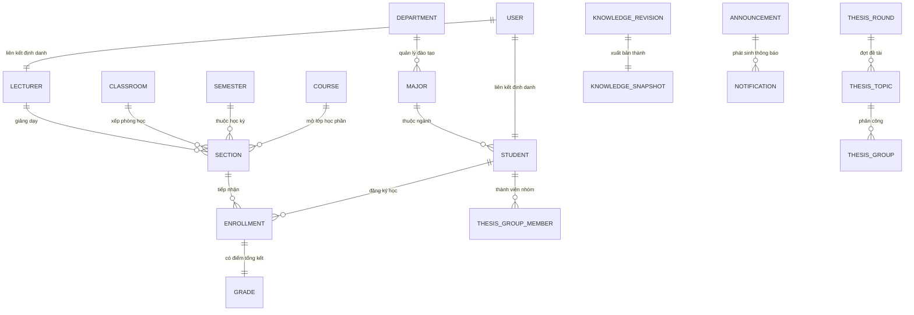
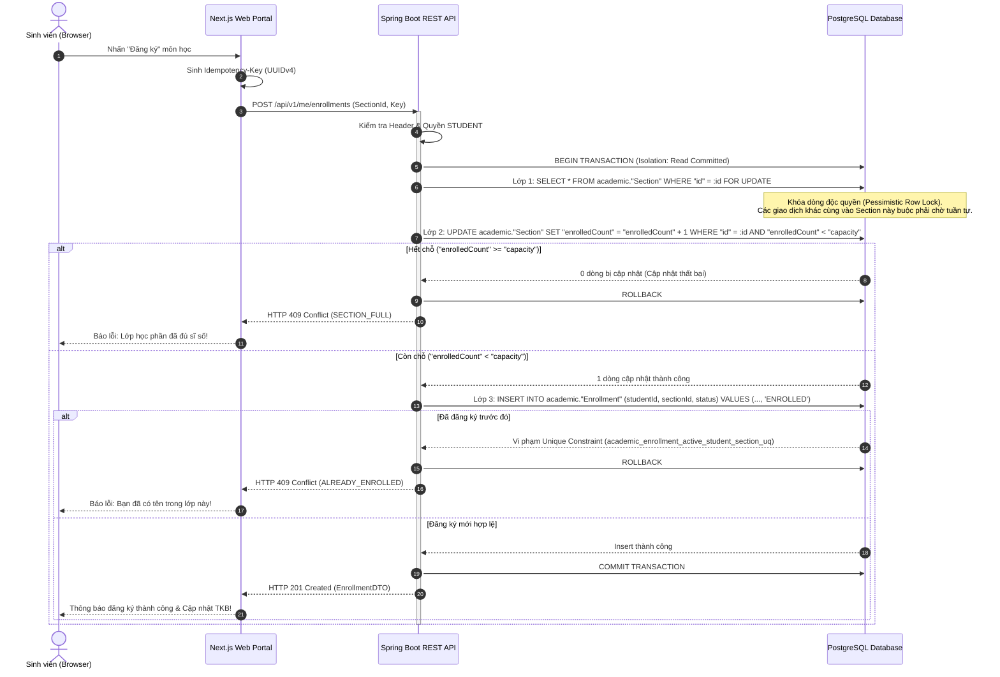
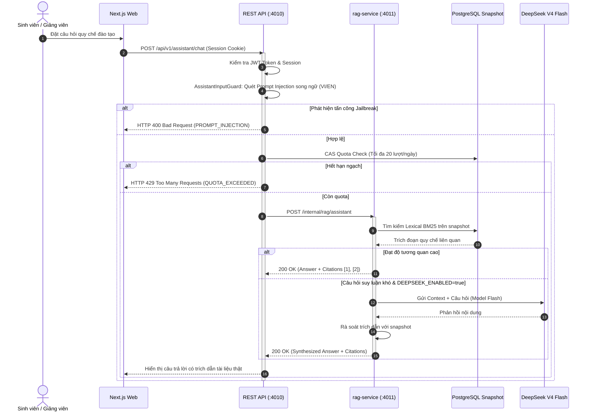
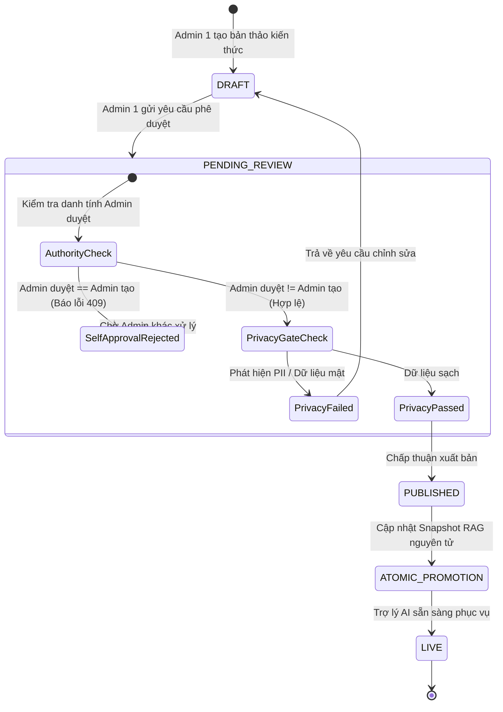

# CampusCore — System Architecture & Engineering Blueprint


> Vector source: [assets/campuscore-system-architecture.svg](assets/campuscore-system-architecture.svg)
> This blueprint documents the runtime boundaries, concurrency invariants, data ownership models, security controls, and design non-goals of **CampusCore**.

---

## 1. Runtime Topology & Network Boundaries

```mermaid
flowchart TD
    subgraph CLIENTS["TẦNG GIAO DIỆN & TRUY CẬP (CLIENTS)"]
        Web["Next.js 15 Web Portal\n(:3000 mặc định | Cookie HttpOnly + CSRF)"]
        Mobile["Expo React Native App\n(Thử nghiệm | Bearer JWT)"]
        Browser["Trình duyệt Người dùng"]
    end

    subgraph BACKEND["TẦNG DỊCH VỤ JAVA (JAVA APPLICATION LAYER)"]
        REST["Spring Boot 3.5 REST API\n(:4010 | /api/v1/)\n• Auth & RBAC Security Filter\n• 4-Layer Registration Engine\n• Gradebook & Transcript Service\n• Thesis Lifecycle Manager\n• Assistant Gateway & Quota Guard"]
        RAG["Private rag-service Sidecar\n(:4011 | chỉ expose nội bộ)\n• Bilingual Prompt-Injection Guard\n• Lexical ranking BM25\n• Snapshot runtime reader\n• Thực thi Flyway migration trong compose"]
    end

    subgraph DATA["TẦNG DỮ LIỆU & LƯU TRỮ (PERSISTENCE)"]
        PG[(PostgreSQL 15\n:5432 host mặc định | DB campuscore_restful\nSchema: campuscore_auth · academic ·\nthesis · assistant · engagement · notifications)]
        Flyway["Flyway Migration Engine\n(versioned scripts trong\njava-services/restful-api/src/main/\nresources/db/migration/)"]
    end

    subgraph EXTERNAL["DỊCH VỤ NGOÀI (EXTERNAL)"]
        DeepSeek["DeepSeek API\ndeepseek-v4-flash (Tùy chọn)"]
        Mailpit["Mailpit Local SMTP\n(:8025 UI / :1025 SMTP)"]
    end

    Browser --> Web
    Web --> REST
    Mobile --> REST

    REST --> PG
    REST --> RAG
    RAG --> PG
    RAG -.-> DeepSeek
    REST -.-> Mailpit
    Flyway --> PG
```

> Trong cụm Docker Compose, `rag-service` là bên thực thi Flyway (`restful-api` chạy với `FLYWAY_ENABLED=false`). Khi chạy JAR trực tiếp, Flyway bật mặc định theo `application.yml`. Cổng host đều ghi đè được qua `.env` (xem `docker-compose.yml`).

### Quy tắc phân chia ranh giới mạng (Boundary Rules):
1. **Một Cổng API Duy Nhất**: Ứng dụng Java (`restful-api`) là dịch vụ duy nhất sở hữu và công khai các route `/api/v1/**` ra bên ngoài.
2. **Cách ly Dịch vụ RAG**: Dịch vụ `rag-service` chạy trên cổng nội bộ `4011`, tuyệt đối không mở port ra internet trong Docker Compose. Mọi truy vấn từ Frontend đều phải đi qua cổng kiểm soát của REST API (`/api/v1/assistant/chat`), nơi thực hiện xác thực người dùng và kiểm tra hạn ngạch.
3. **Phân quyền xác thực Client**:
   - Web Client: Sử dụng HTTP-only SameSite=Strict cookies và CSRF double-submit tokens.
   - Mobile Client: Sử dụng OAuth2-compatible Bearer Access & Refresh Tokens.
   - Cả hai client đều tuân thủ cùng một bản hợp đồng OpenAPI (`/v3/api-docs`).

---

## 2. Mô hình Sở hữu Dữ liệu (Domain Ownership)

PostgreSQL là nguồn dữ liệu duy nhất (Single Source of Truth) của hệ thống. Cơ sở dữ liệu được phân chia thành các schema độc lập và quản lý hoàn toàn bằng **Flyway Migrations**:



1. **`campuscore_auth`**:
   - Lưu trữ `User`, `Role`, `Session`, `RefreshToken`, `AuditLog`.
   - Mật khẩu được mã hóa bằng thuật toán `BCrypt` với chi phí tính toán (strength factor) 10.
2. **`academic`**:
   - Quản lý cây danh mục đào tạo: `Department` -> `Major` -> `Student`, `Lecturer`.
   - Cấu trúc môn học & lịch: `Course`, `Classroom`, `Semester`, `AcademicYear`.
   - Thực thể giao dịch: `Section` (Lớp học phần), `Enrollment` (Đăng ký), `Grade` (Điểm thành phần & điểm thi).
   - Sử dụng mã định danh ổn định (ví dụ: mã số sinh viên `21110001`, mã học phần `MATH140101`).
3. **`thesis`**:
   - Quản lý vòng đời luận văn tốt nghiệp: `ThesisRound`, `ThesisTopic`, `ThesisGroup`, `ThesisGroupMember`.
   - Định danh thực thể hoàn toàn bằng `UUIDv4`.
4. **`assistant`**:
   - Quản lý tri thức RAG: `KnowledgeRevision`, `KnowledgeSnapshot`, `AssistantTurn`, `AssistantTurnLease`.
5. **`engagement`**:
   - Quản lý tin tức và cảnh báo: `Announcement`, `Notification`.
6. **`notifications`**:
   - Hạ tầng phát sinh thông báo riêng khỏi bảng tin `engagement`.

---

## 3. Động cơ Chống Race Condition Đăng ký Học phần 4 Lớp

### Thách thức Kỹ thuật
Trong đợt mở cổng đăng ký tín chỉ (ví dụ: 08:00 sáng), hàng ngàn sinh viên click nút đồng thời để tranh chấp 10 chỗ trống cuối cùng của một lớp học phần chất lượng cao. Nếu chỉ sử dụng logic kiểm tra đơn giản (`if (count < capacity) insert()`), hiện tượng **Race Condition** và **Overselling** chắc chắn xảy ra, dẫn đến sĩ số thực tế vượt quá sức chứa của phòng học.

### Mô hình Phòng thủ 4 Lớp



1. **Lớp 1: Khóa dòng bi quan (Pessimistic Row Lock)**
   Câu lệnh `SELECT ... FOR UPDATE` tuần tự hóa các yêu cầu cạnh tranh cùng một lớp học phần tại tầng lưu trữ PostgreSQL, loại bỏ hoàn toàn các hiện tượng đọc bẩn (Dirty Read) hoặc đọc không thể lặp lại (Non-repeatable Read).
2. **Lớp 2: Cập nhật điều kiện nguyên tử (Atomic Conditional Update)**
   Câu lệnh SQL `SET "enrolledCount" = "enrolledCount" + 1 WHERE "id" = :id AND "enrolledCount" < "capacity"` đảm bảo mức tăng trưởng sĩ số được kiểm chứng ngay tại thời điểm ghi dữ liệu xuống đĩa. Nếu lớp đã chạm ngưỡng, không có dòng nào bị ảnh hưởng và giao dịch bị hủy bỏ.
3. **Lớp 3: Chỉ mục duy nhất cục bộ (Partial Unique Index)**
   Chỉ mục `CREATE UNIQUE INDEX academic_enrollment_active_student_section_uq ON academic."Enrollment" ("studentId", "sectionId") WHERE "status" IN ('ENROLLED', 'PENDING', 'CONFIRMED')` tạo nên một chốt chặn cơ sở dữ liệu bất biến. Ngay cả khi có sự cố logic phần mềm, DB sẽ từ chối ngay lập tức bản ghi thứ hai đang hiệu lực của cùng một sinh viên trong một lớp.
4. **Lớp 4: Khóa chống lặp yêu cầu mạng (Idempotency Key)**
   Mọi thao tác thay đổi trạng thái đều bắt buộc truyền `Idempotency-Key` dạng UUIDv4. Nếu mạng bị chập chờn và client gửi lại request, hệ thống sẽ trả về kết quả đã xử lý trước đó mà không trừ thêm sĩ số lớp học.

---

## 4. Kiến trúc Trợ lý AI (CampusCore RAG Assistant)



- **Ngăn chặn Prompt-Injection Song ngữ (`AssistantInputGuard`)**: Bộ lọc phân tích cú pháp ở cả đầu vào và đầu ra nhằm triệt tiêu các nỗ lực tấn công prompt leak, model hijacking hoặc giả mạo phân quyền bằng tiếng Anh hoặc tiếng Việt.
- **Hạn ngạch nguyên tử (Atomic Quota Bucket)**: Giới hạn 20 lượt hỏi/người/ngày. Kỹ thuật Compare-And-Swap (CAS) ngăn chặn hoàn toàn việc gửi nhiều request đồng thời để vượt ngưỡng.
- **Truy hồi Lexical & LLM Fallback**:
  - Dữ liệu kiến thức được biên soạn và lưu trữ dưới dạng snapshot bất biến trong PostgreSQL.
  - Tìm kiếm Lexical (BM25 / Full-text search) trả về câu trả lời kèm trích dẫn văn bản quy chế chính xác trong vòng 50ms.
  - Khi cần suy luận sâu, ngữ cảnh được gửi đến `deepseek-v4-flash` (không dùng thinking, tối đa 6.000 ký tự). Nếu provider gặp sự cố, timeout hoặc hết tiền, API tự động chuyển về trả lời Lexical nguyên bản mà không bị gián đoạn.

---

## 5. Quy trình Kiểm duyệt Tri thức 2 Quản trị viên (Two-Admin Governance)



- **Four-Eyes Principle**: Mọi thay đổi về chính sách, học phí hay quy định đào tạo phải được duyệt bởi một Admin thứ hai khác với tác giả tạo bản nháp.
- **Privacy Gate**: Rà soát tự động trước khi xuất bản để loại trừ thông tin định danh cá nhân (PII), email riêng tư hoặc bí mật nội bộ.
- **Atomic Promotion**: Cập nhật snapshot trong một câu lệnh giao dịch đơn lẻ, loại trừ hiện tượng người dùng đọc phải snapshot đang cập nhật dở dang.

---

## 6. Thiết kế Giao diện Người dùng (UI Reference Language)

Giao diện người dùng của CampusCore được thiết kế dựa trên ngôn ngữ nhận diện học vụ của **HCMUTE**:
- **Khung vỏ xanh thể chế (Institutional Blue Shell)**: Màu primary `#003F87` cùng nền sáng `#F9F9FF` và điểm nhấn vàng HCMUTE, định nghĩa tập trung trong `frontend/src/app/globals.css`; giao diện hỗ trợ chủ đề sáng/tối và các biến thể màu accent (ví dụ `river-blue`).
- **Khung vỏ dashboard thống nhất**: Thanh điều hướng trên cùng (điều hướng, chuyển ngữ, đổi theme, chuông thông báo) kèm các thẻ chỉ số học tập dựng bằng `WorkspaceSurface`; khung chat Trợ lý AI là drawer riêng (`AssistantPanel`) và trạng thái cấm truy cập xử lý tập trung qua `WorkspaceForbiddenState`.
- **Bảng dữ liệu xanh đậm (Blue Header Tables)**: Hiển thị dày đặc thông tin điểm số, thời khóa biểu, danh sách lớp học phần theo chuẩn học vụ truyền thống.
- **Xử lý trạng thái tường minh**: Toàn bộ các trạng thái Tải dữ liệu (Loading skeleton), Dữ liệu rỗng (Empty state), Lỗi mạng (Error state), và Cấm truy cập (Forbidden 403) đều được xử lý với thông báo rõ ràng, song ngữ.

---

## 7. Ranh giới ngoài phạm vi (Non-goals)

Các thành phần sau đây được xác định rõ ràng là **nằm ngoài phạm vi của đồ án môn học** để giữ cho hệ thống tập trung vào bài toán cốt lõi:
- **Tài chính & Cổng thanh toán trực tuyến** (Finance, Payment gateways).
- **Phân tích kinh doanh nâng cao & Dashboard BI** (Analytics, Data warehouse).
- **Hệ thống hỗ trợ Helpdesk & Ticket** (Support ticketing system).
- **Hạ tầng phân tán phức tạp**: Cụm Redis, RabbitMQ, Kafka, MinIO, Nginx, Kubernetes, Cloudflare tunnels.
- **Cơ sở dữ liệu Vector chuyên dụng** (Milvus, Pinecone, Qdrant): Thay vào đó, CampusCore chứng minh năng lực RAG xuất sắc thông qua PostgreSQL snapshot và Lexical BM25 deterministic ranking.

---

*Tài liệu kiến trúc hệ thống CampusCore — Bản cập nhật phục vụ thẩm định kỹ thuật đồ án.*
